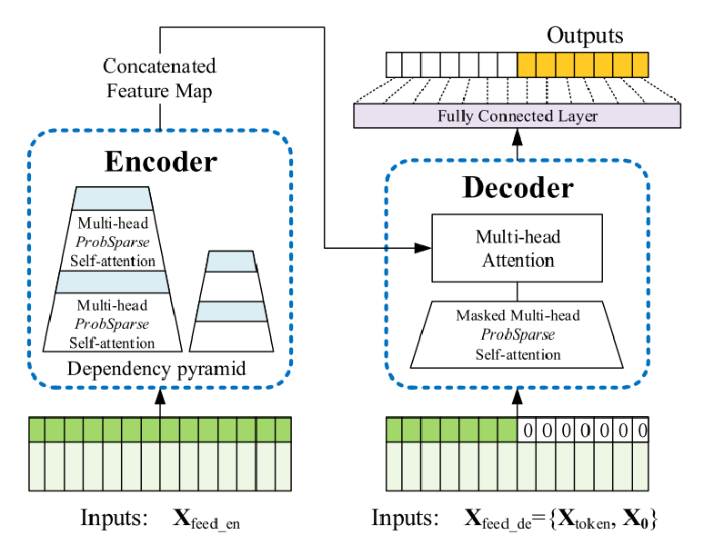
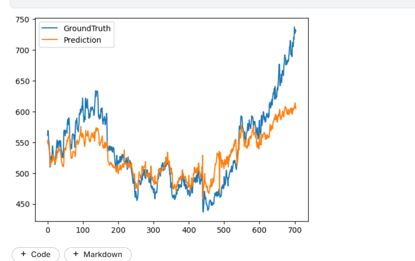
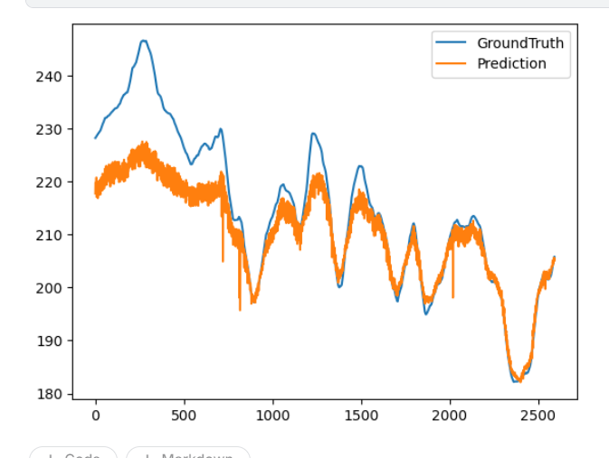
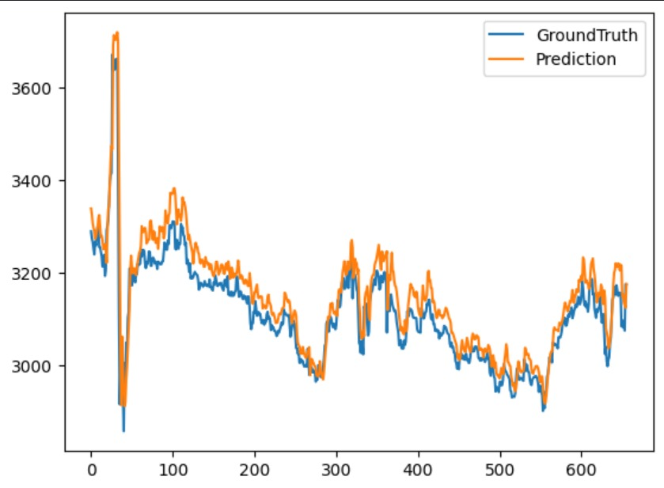

## What is informer ?

Informer is a time series model which is a part of the Transformer family.​

It’s a transformer based model designed for Long sequence time-series forecasting (LSTF). Informer has shown a remarkable ability to capture both long-term patterns and short-term fluctuations. 

## Informer architechture

## Advantage over transformers

Informer solves two major problems of a transformer

1.Quadratic Time Complexity of Attention Mechanism​

By using probSparse attention, informer reduces the time complexity of the attention mechanism from quadratic to O(n logn). Instead of each token attending to every other token, they restrict attention to a limited number of relevant tokens,​

2.Memory Bottleneck of stacking layers for long inputs​

Distillation is a technique which chooses only the active queries from the probSparse and reduces the space required by the subsequent layer. Thus it can further enhance memory efficiency.​

## Informer predictions

### Daily predictions for Infosys Stock

### Daily prediction for Apple stock

### Hourly prediction for Adani stock
