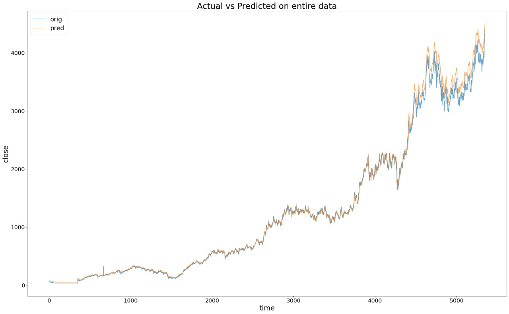
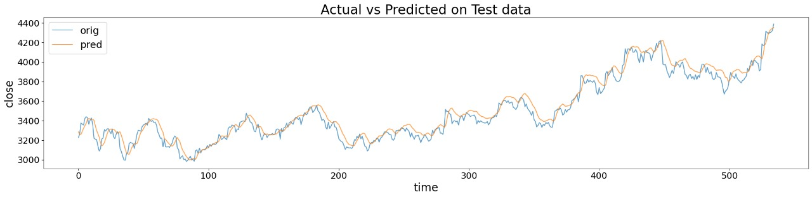

## What is LSTM ?

Long Short-Term Memory (LSTM) is a type of recurrent neural network (RNN) that can process and analyze sequential data, such as text, speech, and time series.
LSTMs are well-suited for problems involving large data sequences and can identify both short-term and long-term dependencies.

## Why LSTM for stock predictions ?

* Long Short-Term Memory (LSTM) is a type of recurrent neural network (RNN) that can process and analyze sequential data, such as time series. ​

* Stock prices, are non-stationary and exhibit trends and seasonality. LSTMs can handle these non-linear relationships within the data.​

* LSTM's can learn long and short term dependencies by selectively retaining information through the memory cell and gates.
* This characteristic is particularly beneficial in financial time series analysis, where understanding previous market trends is vital for forecasting future price changes. By maintaining a memory cell that stores relevant information over extended periods, LSTMs demonstrate superior performance in capturing subtle nuances and trends within complex trading datasets.

* Our LSTM model takes 5 features namely, Open, High, Low, Adjusted close and Volume and label is the Closing Price .
## LSTM model layers

``` python
model=Sequential()
model.add(LSTM(64,return_sequences=False,input_shape = (X_train.shape[1],X_train.shape[2])))
model.add(Dropout(0.2))
model.add(Dense(20))
model.add(Dense(1))
model.compile(optimizer=Adam(learning_rate=0.001), loss='mean_squared_error')
history=model.fit(X_train,y_train, batch_size = 128,epochs = 100,validation_split=0.2, verbose=1)
```

## Graph for a stock closing price predicition

### TCS STOCK




### INFOSYS STOCK


### NESTLE STOCK


## Problem with LSTM'S

A stock becomes more volatile when its price experiences larger and more frequent fluctuations over a short period of time. For such high-volatile stocks​

The frequent spikes in price confuse the LSTM and it would interpret them as noise instead of meaningful dependencies.

An example of this is the adani enterprises stock as shown below 
### ADANI ENTERPRISES STOCK


