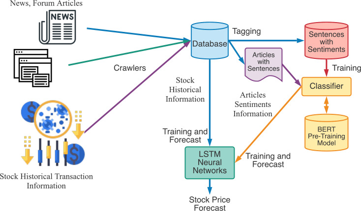

## What can we add as a future extension to this project ?

### 1. Sentiment analysis

The performance of the stock market is also affected by news which is a public and global information source for everyone. By recognizing the sentiments in the news will become important vectors for predicting the stock prices.

So we would try to combine stock price history and pre-training Bidirectional Encoder Representations from Transformers (BERT) model to recognize the sentiment as input vectors from news and forum posts for individual stock.

Process-

- Collect information from tweets and other resources using twitter API and news publications for each day.
- Store that which would be further used for sentiment analysis
- Input the pre-processed sentences of news articles into the BERT model and determine whether each sentence belongs to positive or neutral or negative sentiment. 
- Training the LSTM : Analysed sentiments will be sent to LSTM neural networks along with stock historical  information for training. 
- Finally predict the stock prices

### 2. Portfolio optimization

Extending the project from predicting individual stock prices to developing a stock recommendation system or optimizing a portfolio.

Portfolio Optimization by using the prediction model to build a portfolio of stocks that minimizes risk while maximizing returns based on future predictions.

### 3. Risk Metrics

Apart from stock price prediction we can expand your project to predict stock volatility and assess risk using models like GARCH (Generalized Autoregressive Conditional Heteroskedasticity) or VaR (Value at Risk).

Risk Management tools assess the risk associated with a particular stock based on predicted price movements and volatility levels.

### 4. Hybrid model

Now that we know the drawbacks and strengths of the models we have explored , a hybrid approach combining LSTM + Informer could be tested for stock predictions.