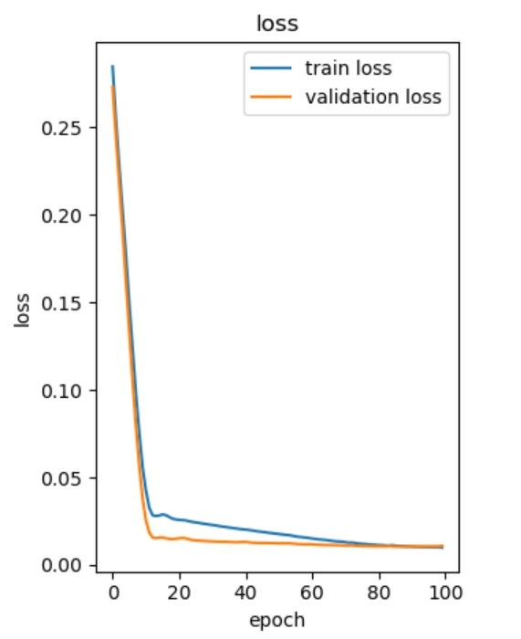
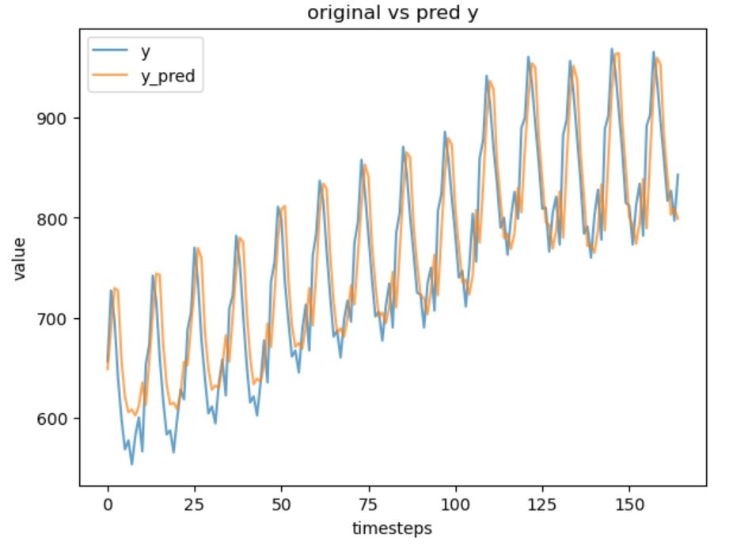

## Univariate time series forecasting
Mini project is based on univariate time series forecasting where we predic the milk production in a month based on data of milk productions in previous 3 months.

Our project is multivariate time series forecasting as it takes multiple features as input and predicts the closing price.

Hence, to form a basic understanding we decided to use a single variable time series forecasting as our mini project.

### How it works

* Data collection and preprocessing by using min-max scaler since LSTM is senstive to scale of input data
* Defining sequence : Sliding Window Approach where each input sequence consists of a fixed number of past time steps
* Splitting the data : Make train,validation and test set, take a sequence length of 3
* Building the model : Use an sequential model with Input, LSTM, Dense and Dropout layers
* Training model : Use adam optimizer to adjust parameters and MSE for loss
* Finally run the fit method to run the model on training set 
* Make predictions on the test data and plot the graph 
 
### Loss graph

### Predicted vs Actual

