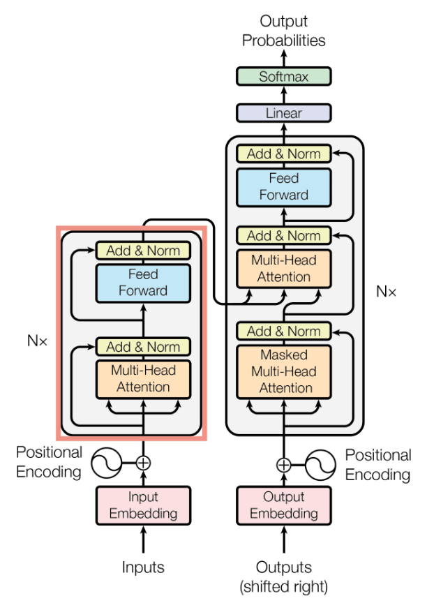

## What are transformers ?

## Why explore transformers for stock predictions ?
LSTM's might struggle for long range dependencies. They still face challenges when it comes to learning relationships across very distant time steps. 

Unlike traditional recurrent neural networks (RNNs), Transformers leverage attention mechanisms to weigh the significance of each input element concerning others. This mechanism allows them to process information in parallel, enhancing efficiency in analyzing complex financial data patterns. This makes transformers particularly powerful for capturing both short-term and long-term dependencies in a sequence

## Transformer Architechture

EXPLAIN KARNA KOI

## Predictions on various Stocks

graphs daalne hai!

## Drawbacks of Transformer

Absolute price prediction

While Transformers offer remarkable capabilities, they face challenges when it comes to absolute price sequence prediction in financial markets. LSTM-based models outperform Transformers in predicting price movements and differences due to their inherent sequential processing nature. 

Transformers exhibit limitations in this aspect due to their focus on self-attention mechanisms rather than sequential processing, impacting their precision in predicting price movements accurately and restricting the effectiveness in certain trading scenarios that require precise price forecasting.

## So how to choose between Transformers and LSTM's ?

When deciding between Transformers and LSTMs we need to consider our trading strategy's specific requirements and objectives

### LSTM's

If your trading strategy prioritizes precise absolute price predictions and robust sequence forecasting, LSTM models may be better suited for your needs. Their ability to capture intricate patterns over time steps can provide valuable insights for strategic decision-making based on historical data trends

Their robustness in capturing subtle price fluctuations and trends makes them a preferred choice for traders seeking accurate predictions for informed decision-making.

### Transformers 

In some practical trading strategies , directional trends are often more valuable than exact future prices.

Predicting directional movement requires fast and efficient computation, especially in high-frequency trading scenarios where speed is critical

We would want our model to focus on determining the directional movement of stock prices. Say we aim to predict whether the stock price at the end of the third hour will be higher or lower than the last known price at the end of the second hour.

Transformer's self attention mechanism helps to capture these long-term overall bullish/bearish trends.

This is wher transformers would be beneficial as they save on the computation cost and provide better scalability than LSTM's for near-real-time prediction strategies.

